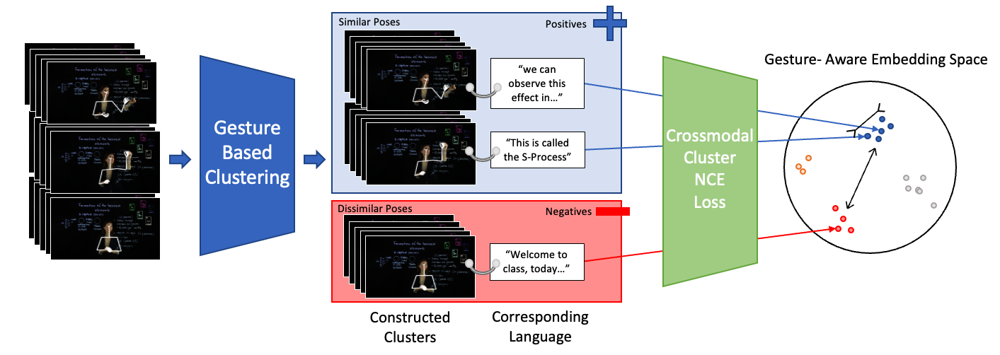

# CC-NCE

This is the official repository for the paper *Crossmodal clustered contrastive learning: Grounding of spoken language to gesture* 

[Dong Won Lee](http://dongwonl.com), [Chaitanya Ahuja](http://chahuja.com), [Louis-Philippe Morency](https://www.cs.cmu.edu/~morency/) - [GENEA @ ICMI 2021](https://genea-workshop.github.io/2021/)

[](https://opensource.org/licenses/MIT)

Links: [Paper](https://openreview.net/pdf?id=o8CpxaBurZQ), [Presentation Video](https://youtu.be/L5dHXTpCkeI), [Dataset Website [1]](http://chahuja.com/pats)

<!-- Bibtex:

```sh
@inproceedings{ahuja2020no,
  title={No Gestures Left Behind: Learning Relationships between Spoken Language and Freeform Gestures},
  author={Ahuja, Chaitanya and Lee, Dong Won and Ishii, Ryo and Morency, Louis-Philippe},
  booktitle={Proceedings of the 2020 Conference on Empirical Methods in Natural Language Processing: Findings},
  pages={1884--1895},
  year={2020}
}
``` -->

# Overview



This repo has information on the training code and pre-trained models. 

For the dataset, we refer you to:
* [Dataset Website](http://chahuja.com/pats) for downloading the dataset
* [Dataset Repo](https://github.com/chahuja/pats) for scripts to download the audio files and other dataloader arguments. 

For the purposes of this repository, we assume that the dataset is downloaded to `../data/`

This repo is divided into the following sections:

* [Clone](#clone)
* [Set up environment](#set-up-environment)
* [Training](#training)
* [Inference](#inference)
* [Rendering](#rendering)

## Clone
Clone only the master branch,

```sh
git clone https://github.com/dondongwon/CC_NCE_GENEA.git
```

## Set up Environment
* pycasper

```sh
mkdir ../pycasper
git clone https://github.com/chahuja/pycasper ../pycasper
ln -s ../pycasper/pycasper .
```

* Create an [anaconda](https://www.anaconda.com/) or a virtual enviroment and activate it

```sh
pip install -r requirements.txt
```

## Training
To train a model from scratch, run the following script after chaging directory to [src](src/),

```sh


python train.py 
-path2data ../data ## path to data files
-seed 11212 / manual seed
-cpk 1GlobalNoDTW \ ## checkpoint name which is a part of experiment file PREFIX
-exp 1 \ ## creates a unique experiment number
-speaker '["lec_cosmic"]' \ ## Speaker
-save_dir save/aisle \ ## save directory
-num_cluster 8 \ ## number of clusters in the Conditional Mix-GAN
-model JointLateClusterSoftContrastiveGlobalDTW_G \ ## Name of the model
-fs_new '15' \ ## frame rate of each modality
-modalities '["pose/normalize", "audio/log_mel_400", "text/tokens"]' \ ## all modalities as a list. output modality first, then input modalities
-gan 1 \ ## Flag to train with a discriminator on the output
-loss L1Loss \ ## Choice of loss function. Any loss function torch.nn.* will work here
-window_hop 5 \ ## Hop size of the window for the dataloader
-render 0 \ ## flag to render. Default 0
-batch_size 32 \ ## batch size
-num_epochs 20 \ ## total number of epochs
-stop_thresh 3 \ number of consequetive validation loss increses before stopping
-overfit 0 \ ## flag to overfit (for debugging)
-early_stopping 1 \ ## flag to perform early stopping 
-dev_key dev_spatialNorm \ ## metric used to choose the best model
-feats '["pose", "velocity", "speed"]' \ ## Festures used to make the clusters
-note 1GlobalNoDTW \ ## Notes about the model
-dg_iter_ratio 1 \ ## Discriminator Generator Iteration Ratio
-repeat_text 0 \ ## tokens are not repeated to match the audio frame rate
-num_iters 100  \ ## breaks the loop after number of iteration
-min_epochs 10 \ ## early stopping can occur after these many epochs occur
-optim AdamW \ ## AdamW optimizer
-lr 0.0001 \ ## Learning Rate
-DTW 0 \ ## Use dynamic time warping to construct clusters in the output space of poses


```

Example scripts for training models in the paper can be found as follows,

- [Ours w/ cc_nce](src/jobs/ours.py)
- [Ours w/o cc_nce](src/jobs/MOCO.py)
- [Ours w/o cc_nce + w/ MoCo](src/jobs/moco.py)
- [Ours w/o cc_nce + w/ Patchwise](src/jobs/patchwise.py) 

## Inference
### Inference for quantitative evaluation

```sh
python sample.py \
-load <path2weights> \ ## path to PREFIX_weights.p file
-path2data ../data ## path to data
```

## Rendering

```sh
python render.py \
-render 20 \ ## number of intervals to render
-load <path2weights> \ ## path to PREFIX_weights.p file
-render_text 1 ## if 1, render text on the video as well.
-path2data ../data ## path to data
```


## References
```sh
[1] - Ahuja, Chaitanya et al. "Style Transfer for Co-Speech Gesture Animation: A Multi-Speaker Conditional Mixture Approach" ECCV 2020.
[2] - Kucherenko, Taras, et al. "Gesticulator: A framework for semantically-aware speech-driven gesture generation." ICMI 2020.
[3] - Ginosar, Shiry, et al. "Learning individual styles of conversational gesture." CVPR 2019.
```

## Other cool stuff
If you enjoyed this work, I would recommend the following projects which study different axes of nonverbal grounding,
- [Mix-StAGe](http://chahuja.com/mix-stage)
- [Language2Pose](http://chahuja.com/language2pose)
- [Dialogue2Pose](https://arxiv.org/pdf/1910.02181.pdf)

